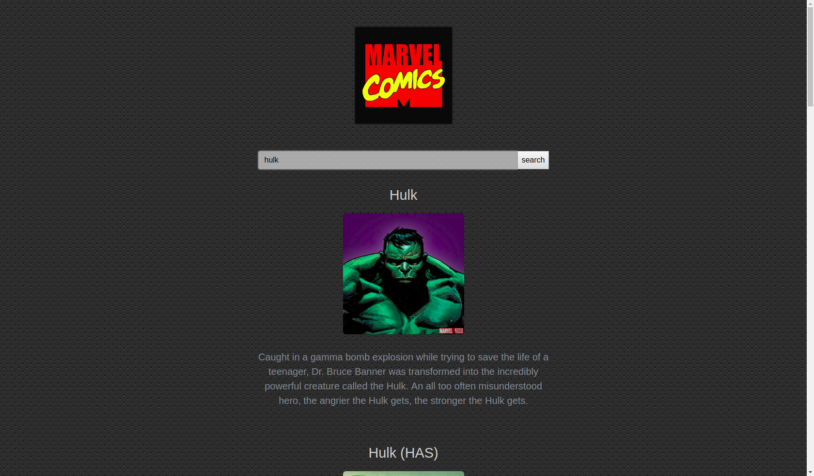

## Getting displaying Data from the [Marvel Developer API](https://developer.marvel.com/)

This is my first attempt of handling data retrived from an API. :bowtie:

## Try this :poo: out! 

Type for example ***spider-man*** in the searchfield and press ***search*** then after a short while
some data should appear below the input area!

<p align="center"> 

</p>

## Project Info

[Bootstrap](getboostrap.com) and ***JQuery*** are used for this small project. No ***Task-Manager*** was needed.

## Live-Version

See the application live [here](https://bjarnesoerensen.github.io/marvel_api/)

## Local Version

If you have cloned the repository please run:

```
npm run setup
```
